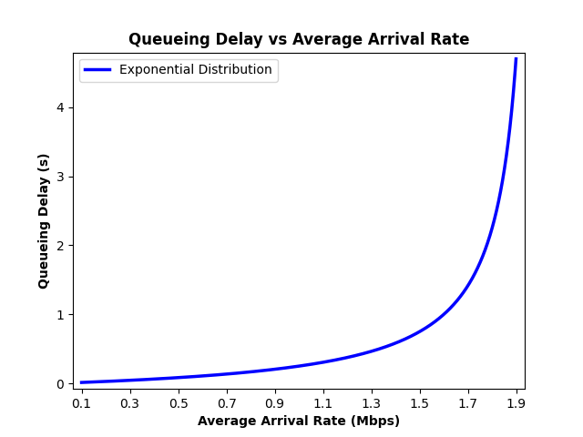

# Assignment 1 :chart_with_upwards_trend:

**Previous Question:** What is the average waiting time in the queue (i.e., queueing delay) if the arrival rate to 
that queue follows an exponential distribution with an average rate of 1.7 Mbps and that 
queue is served by a transmission channel with a 2 Mbps rate?

**Assignment:** Write a python script that plots the queueing delay (y-axis) vs the average arrival rate (x-axis) for the system in previous question. The range should be from 0.1 Mbps to 1.9 Mbp

# Dependencies
* Packages
    ```python
    import numpy as np # numpy package
    import matplotlib.pyplot as plt # matplotlib package
    ```
* Install dependencies
   ```
    python -m pip install -U matplotlib
    python -m pip install -U numpy
   ```
# Software Development
| Software | Enviroment |
| :---:    | :--:       |
|  |  |

# Output


## Author
* [**Jesus Minjares**](https:/github.com/jminjares4)
  * Master of Science in Computer Engineering