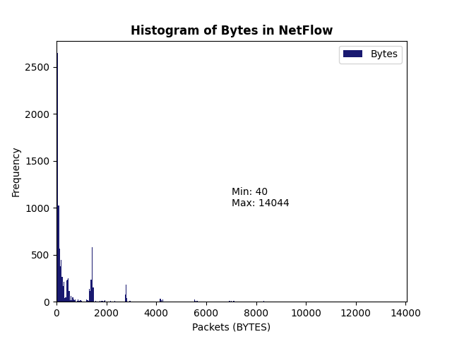

# Assignment 2 :chart_with_upwards_trend:

Capture flow data with pmacct to a CSV file. Write a python script to load the CSV file 
into a PANDAS dataframe, print the minimum and maximum number of flow bytes, and 
plot the histogram of flow bytes; all with PANDAS functions (use v1.4 of PANDAS). I 
want to see a lot of detail in the histogram so do not use the default number of bins, use 
many more. Hint: use column=’BYTES’ as one of the arguments to the hist() function to 
get it to work correctly.

# Dependencies
In order to read packet in the network, the assignment required to use `pmacctd` and `nfacctd`. Here is the link to install [**pmacct**](https://github.com/pmacct/pmacct).

* Install all dependencies:
- Debian/Ubuntu
  - `apt-get install libpcap-dev pkg-config libtool autoconf automake make bash libstdc++-dev g++`
- CentOS/RHEL
  - `yum install libpcap-devel pkgconfig libtool autoconf automake make bash libstdc++-devel gcc-c++`
* Install software
```bash
 ~# git clone https://github.com/pmacct/pmacct.git
 ~# cd pmacct
 ~#  ./autogen.sh
 ~# ./configure #check-out available configure knobs via ./configure --help
 ~#  make
 ~#  make install #with super-user permission
```
# Software Development
| Software | Enviroment |
| :---:    | :--:       |
|  |  |

# Output


## Author
* [**Jesus Minjares**](https:/github.com/jminjares4)
  * Master of Science in Computer Engineering